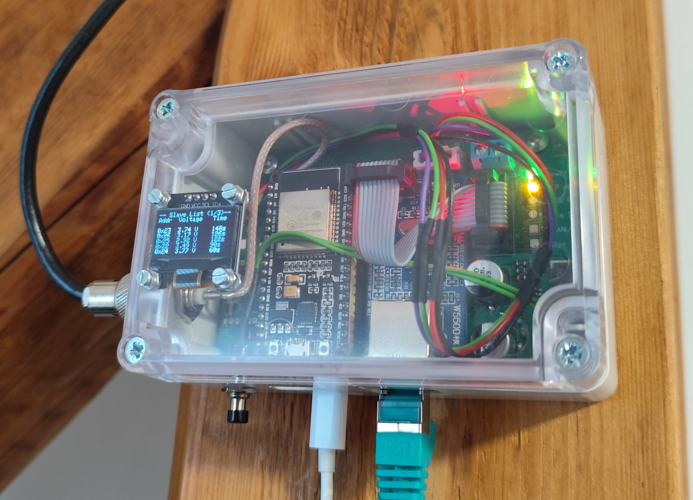
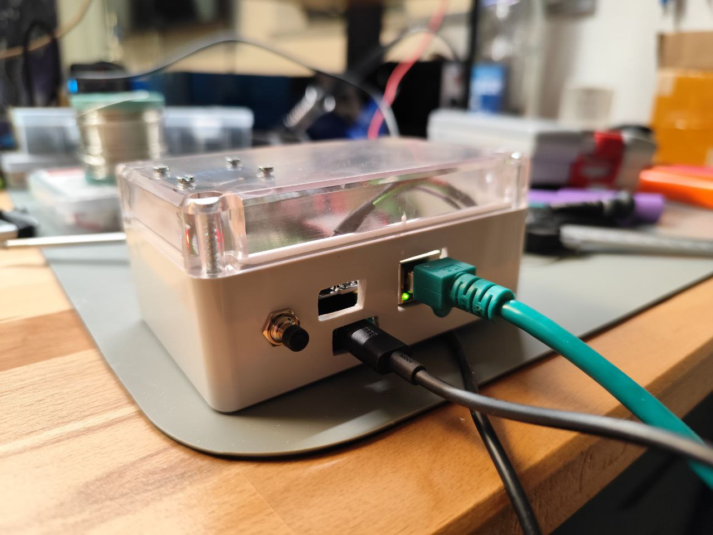

# smartHome_BaseStation

This Smart Home base station is built around an **ESP32** as the controller and uses an **RFM69HW** 433 MHz radio module for the wireless communication with sensors and actuators. For network communication with an MQTT server, a W5500 Ethernet PHY is used. Status information is displayed via status LEDs and an **I2C OLED display**. To improve the range of the radio system, I used an external dipol antenna. The PCB antenna works okay, but the range is not sufficient for the sensors outside my flat.

